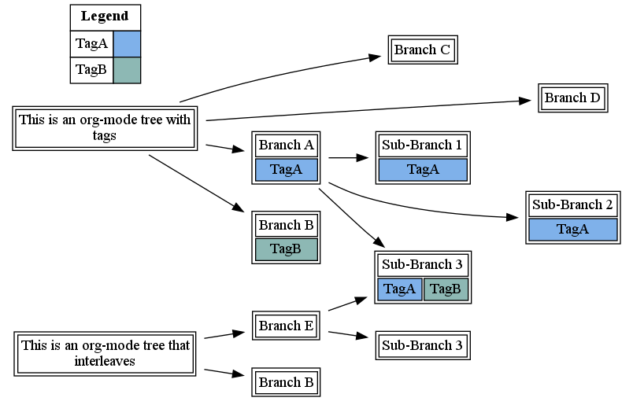
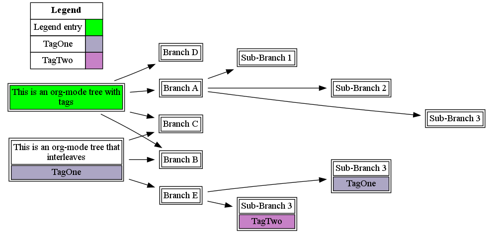

# org-mind-map
This is an emacs package that creates graphviz directed graphs from org-mode files.

# Requirements

This package relies on the [Graphviz](http://graphviz.org/) suite of graphical diagramming tools. 
## windows 
(the default option), these tools are available via [cygwin](http://cygwin.com/). 
## linux 
these tools are available through any of the popular package managers.
## mac
binarys are at the graphviz site, but for recent versions like El Capitan, Sierra and High Sierra, macports or
homebrew are recommended.

```bash
brew install graphviz
```

This package also relies on the org-mode and dash libraries, available from melpa (M-x list-packages).

# Installation and usage

To install, add this code to your .emacs:

```elisp
(load "INSTALLPATH/org-mind-map.el")
```

Then, run `M-x org-mind-map/write` within the org-mode file you would like to make a mind-map for. If all works as expected, a PDF file will be generated in the same directory as the org file.

# Examples

## Basic concept

Here is an example org-mode tree that demonstrates the basic concept:

```Org
* This is an example org-mode tree
The content of the node doesn't matter.
** Branch A
*** Sub-Branch 1
*** Sub-Branch 2
*** Sub-Branch 3
** Branch B
** Branch C
** Branch D
```

and the result is shown below:


## Tags

You can also add tags, as in this org-mode file:

```Org
* This is an org-mode tree with tags
** Branch A :TagA:
*** Sub-Branch 1 :TagA:
*** Sub-Branch 2 :TagA:
*** Sub-Branch 3 :TagA:TagB:
** Branch B :TagB:
** Branch C
** Branch D
```

These are randomly color-coded into pastel tags:


## Interleaving Graphs

Finally, by naming headlines across your org-mode file, as shown below, you can interleave trees.

```Org
* This is an org-mode tree with tags
** Branch A :TagA:
*** Sub-Branch 1 :TagA:
*** Sub-Branch 2 :TagA:
*** Sub-Branch 3 :TagA:TagB:
** Branch B :TagB:
** Branch C
** Branch D
* This is an org-mode tree that interleaves
** Branch E
*** Sub-Branch 3
*** Sub-Branch 3 :TagA:TagB:
** Branch B
```


 this results in this file:



Note that the interleaving is done based on the exact text of the headline, so these have to exactly match (including tags).


## Selective Colors
   If you would like a node to show up as a specific color, you can add the `:OMM-COLOR:` and `:OMM-LEGEND:` properties to a node. The node will be colored in, and a legend entry item will be added, as shown below:

```Org
* This is an org-mode tree with tags
:PROPERTIES:
:OMM-COLOR: GREEN
:OMM-LEGEND: Legend entry
:END:

** Branch A 
*** Sub-Branch 1 
*** Sub-Branch 2 
*** Sub-Branch 3 

** Branch B


** Branch C 
** Branch D 
* This is an org-mode tree that interleaves :TagOne:
** Branch E
*** Sub-Branch 3 :TagTwo:

*** Sub-Branch 3 :TagOne:
** Branch B
** Branch C
```

 this results in this file:



# Other Options

Customize the `org-mind-map/engine` variable to specify additional layout options (e.g. radial layouts where root nodes are in the center of the graph), and customize `org-mind-map/rankdir` to specify if the chart is going up-and-down or left-to-right.

## Selective Export
   Use the command `org-mind-map/write-tree` to just create a map from the current tree.